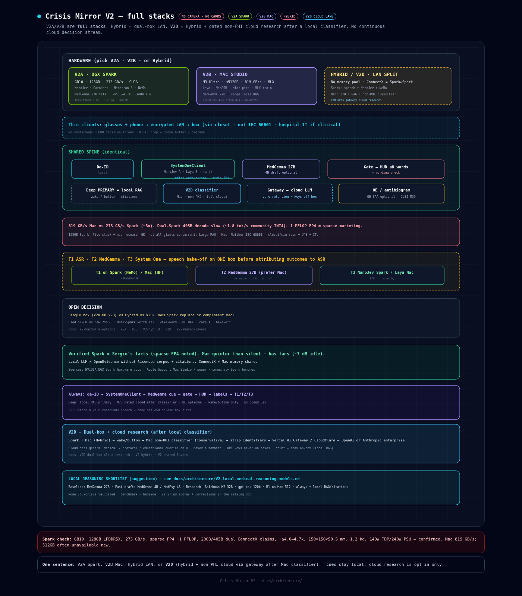

# Crisis Mirror

**Smart glasses ambient AI — cognitive companion for clinical medicine**  
Real-time advisory cue + cost/quality feedback loop for all intensive care units (medical, surgical, transplant, neuro, cardiac, and other critical care units). Advisory only; the clinician decides.

## Concept

Ambient **audio** (glasses mics and/or phone) → **phone/iPad edge brain** (local protocol pack + safety gate) → discrete cue (**HUD text + tone**) → clinician action → post-hoc labels (*helpful?* *accurate?*) for **offline** training.

Optional **OpenEvidence / UpToDate-class** APIs = deep consult after a trigger — not continuous cloud listening.

### Design law: no wearable camera (v1)

Face-worn video is a PHI / consent / unit-culture problem.  
**v1 senses with sound only.** Visual context is out of scope until separately approved.

### Where the brain lives

| Layer | Device | Role |
|-------|--------|------|
| Thin wearable | Smart glasses (**no camera**) | Mics + HUD (+ bone conduction if present) |
| Edge brain | iPhone / iPad nearby | Real-time detect + local protocols + safety + label UI |
| Deep consult | Secure cloud APIs | Broader evidence on demand (stripped queries) |

## Hardware lean

| Path | Device | Why |
|------|--------|-----|
| **Clinical / privacy-native** | [Even Realities G2](https://www.evenrealities.com/) | **No camera**, HUD + mics; tone via phone or BC earbuds (G2 has no speakers) |
| **Open-source build** | [Brilliant Labs Halo](https://brilliant.xyz/) | Open stack + onboard bone conduction; **camera hard-off** for clinical mode |
| **Before any glasses** | Phone only | Mic + headphones + on-screen HUD — valid sim path |

Details and scorecard: [ONEPAGER.md](ONEPAGER.md).

## Artifacts

| File | Description |
|------|-------------|
| [ONEPAGER.md](ONEPAGER.md) | Product brief, MVP, safety, hardware scorecard |
| [FUNDING.md](FUNDING.md) | Funding map: institutional → NIH/AHRQ → SBIR → ARPA-H |
| [VCU-ANESTHESIOLOGY-FUNDS-REQUEST.md](VCU-ANESTHESIOLOGY-FUNDS-REQUEST.md) | Internal funds request — VCU Dept of Anesthesiology |
| [crisis-mirror-architecture.html](crisis-mirror-architecture.html) | Interactive dark architecture diagram (V2: dual speech · Jev core · no cards) |
| [assets/crisis-mirror-architecture.png](assets/crisis-mirror-architecture.png) | Architecture diagram (PNG) |
| [crisis-mirror-flow.excalidraw](crisis-mirror-flow.excalidraw) | Editable flow (open on [excalidraw.com](https://excalidraw.com)) |
| [assets/original-sketch.jpg](assets/original-sketch.jpg) | Original whiteboard sketch (historical) |

## V2 architecture notes (speech A/B · local System One)

V2 **supersedes the V1 protocol-card layer** and **removes cloud Jev**. The System One decision/routing layer is **fully local**: **NanoJev** (0.6B, MIT, :8765) is **default**; **Laya** (~421M, Apache, Apple MLX) is **fallback** — interchangeable via a client abstraction (NanoJev needs an API adapter). Same model fills salience, category routing, escalation, and action/urgency. **Fast path:** MedGemma + domain tools (e.g. local antibiogram). **Cloud:** deep research only when escalated (BAA). Only speech is A/B’d. See critical flags in the shared note.

| File | Description |
|------|-------------|
| [docs/architecture/V2-shared-layers.md](docs/architecture/V2-shared-layers.md) | Shared path: V2A=Spark+NanoJev · V2B=Mac+Laya · optional Hybrid, MedGemma fast, deep research cloud-only, flags |
| [docs/architecture/V2A-nvidia-speech.md](docs/architecture/V2A-nvidia-speech.md) | Parakeet-TDT + Nemotron-3 Diarization |
| [docs/architecture/V2B-google-speech.md](docs/architecture/V2B-google-speech.md) | MedASR + open-weight diarization options |
| [docs/architecture/V2-speech-comparison.md](docs/architecture/V2-speech-comparison.md) | Full-stack A/B comparison |
| [docs/architecture/V2-hardware-options.md](docs/architecture/V2-hardware-options.md) | Mac Studio vs DGX Spark vs Hybrid |
| [docs/architecture/V2-hybrid.md](docs/architecture/V2-hybrid.md) | Dual-box service split |
| [docs/architecture/V2D-dual-box-cloud-research.md](docs/architecture/V2D-dual-box-cloud-research.md) | **V2D**: Hybrid + gated non-PHI cloud research (classifier → gateway) |
| [docs/architecture/V2-local-medical-reasoning-models.md](docs/architecture/V2-local-medical-reasoning-models.md) | Local research LLM options + verified scores |
| [crisis-mirror-architecture.html](crisis-mirror-architecture.html) | Diagram: V2A/V2B/Hybrid/V2D → local System One → fast/deep (+ V2D cloud after classifier) → gate → HUD |

## Status

Early concept / sim-lab first. **Camera-free v1.** Not a medical device. Advisory cognitive-forcing only.

## License

Private working notes unless otherwise stated.
