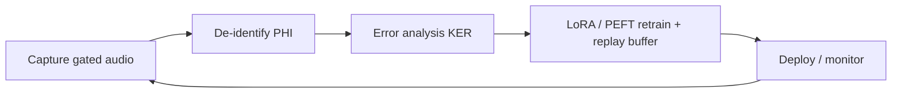

# V2 Shared Layers (identical for V2A and V2B)

> **Scope.** Everything downstream of the on-device speech layer is **textually identical** for V2A (NVIDIA) and V2B (Google). Only ASR + diarization differ. V2A and V2B notes both point here; a verbatim copy also appears in each note so A/B comparison stays clean when reading a single file.
>
> **V2 supersedes V1 cue content.** V1 used local protocol / “Stanford-style” card libraries for HUD wording. **V2 has no protocol cards, no pocket-binder cue library, and no card-lookup step.** Jev’s typed outputs *are* the decision; the clinician-visible cue comes from a thin category→display-label map (proposal) or another explicit alternative — see open questions.

**Product:** Crisis Mirror — ambient, camera-free AI cognitive-forcing companion for transplant ICU / critical care.  
**Phase 1:** 4-week sim MVP (no PHI in sim); Jev included.  
**Phase 2 gates:** BAA or provable de-ID, thresholds validated from clinician labels, IRB, Halo camera-off profile.  
**Design law:** no wearable camera v1 · advisory language only · human decides · no continuous cloud streaming · offline-only learning · full audit log · role separation.

---

## Open questions created by the V2 architecture reset (read first)

These are **product decisions**, not speech-stack choices. Flag prominently for Sergio + the software engineer.

### OQ-1 — How does Jev categorization become a clinician-visible cue?

**Fact:** Jev emits **no free text**. It returns typed answers: Noul probability, Choice (+ confidence), Score (+ confidence).

| Option | Mechanism | Pros | Cons |
|--------|-----------|------|------|
| **A — Default proposal** | Each category in the closed Choice set carries a short, **clinician-vetted display label** (≤8 words, advisory phrasing). UI renders that label **verbatim** when Choice wins. | No generative clinical prose; auditable; advisory language locked at taxonomy time | Honestly: this is still a **thin closed list** (category→label), just much smaller than a V1 card library — not “no list at all” |
| **B — Generative cue** | A separate LLM writes ≤8-word HUD text from the de-ID summary + chosen category | Flexible wording | Hallucinated clinical wording risk; extra cloud call / latency; larger PHI/BAA surface; harder audit |

**Decision needed:** A vs B (or hybrid: label default, generative only on escalation). Document the choice in code as `cue_render_mode`.

### OQ-2 — Category taxonomy ownership

- Who **owns / approves** the closed Choice category set (clinical lead, sim faculty, both)?
- How many categories for Phase 1 sim (proposal: start small, e.g. 8–20; hard cap 255)?
- How is **`none` / `other` / low-confidence** handled (silent log? no HUD? force escalation)?

### OQ-3 — Escalation to external evidence

Default design proposal: a **separate Jev Noul** question — *needs external evidence?* — or an **escalation flag tied to category**. OpenEvidence / UpToDate-class APIs fire **only** when that signal is true. Jev decides escalation so tool calls stay minimal.

Still open:

- Separate Noul vs category-flag?
- What is shown to the clinician when evidence returns (second HUD line? phone panel? deferred)?
- Latency budget for the evidence round-trip?

### OQ-4 — Gate inputs

Does the fire/silent/nothing gate use **only** the yes/no (Noul) probability, or also **category (Choice) confidence** (and/or Score)? Proposal to tune in sim: require Noul ≥ threshold **and** Choice confidence ≥ threshold before fire.

### OQ-5 — What labels tune

Clinician helpful/accurate labels feed:

1. **ASR flywheel** (KER → LoRA/replay), and  
2. **Jev threshold tuning** (and possibly taxonomy *revisions* offline).

**Jev weights themselves are not fine-tuned by us** (cloud vendor model). Clarify whether taxonomy edits are in-scope for the labeling loop or a separate clinical governance process.

---

## 1. ASR flywheel (post-speech, shared)



| Step | What | Notes |
|------|------|-------|
| Capture | Gated room / clinician audio buffers on edge | Not continuous cloud dump; short buffers only |
| De-identify PHI | Strip names, MRNs, dates, free-text identifiers from transcripts **before** any cloud path or training store | Phase 1 sim: synthetic / actor scripts, no real PHI |
| KER | Keyword Error Rate on protocol-critical terms (drug names, vitals thresholds, crisis checklist items) — preferred over raw WER for this product | Logged beside clinician labels |
| Retrain | LoRA/PEFT adapters + **replay buffer** of prior domains to limit catastrophic forgetting | Offline job only; never silent bedside self-change |
| Deploy / monitor | Signed adapter drops; audit version in every cue log | Hold-out eval set frozen before each train |

---

## 2. Jev — core decision & categorization engine

Jev is **not** triage in front of a card library. After the speech layer produces a de-identified state summary, **Jev’s outputs *are* the decision.**

| Jev type | Crisis Mirror use | Meaning |
|----------|-------------------|---------|
| **Noul** (yes/no probability) | *Is action warranted?* | Whether a cue should be considered at all |
| **Choice** (≤255 options + confidence) | *What is this situation?* | Closed **category** set (not free text; not a card ID) |
| **Score** (ordered levels + confidence) | *Urgency* | Ordinal urgency for tone / priority |

- **Vendor / model:** TypeSafe AI **Jev** (~Sep 15 2026 early access). Text-only, cloud-only.
- **Access:** TypeSafe / Vercel AI Gateway `typesafe-ai/jev` / Cloudflare as documented by TypeSafe.
- **Latency / cost (vendor claims):** ~70–500 ms; ~$0.042 / M input tokens — measure in sim.
- **Calibration:** claimed; **unpublished** — do not assert clinical calibration.
- **ZDR ≠ HIPAA BAA.** Phase 2 needs a real BAA **or** provable de-ID before live PHI leaves the edge.
- **Input:** de-identified state summary only (never raw audio, never identifiers).
- **Optional fourth question:** Noul *needs external evidence?* (see OQ-3).

---

## 3. Conditional deeper research (not default)

```
Jev indicates complex / escalation
        │
        ▼
OpenEvidence / UpToDate-class API  (stripped query only)
        │
        ▼
evidence result → clinician UI (form TBD — OQ-3)
```

- Invoked **only** when Jev says so (separate Noul or category flag).
- Keeps tool calls minimal; default path is **no** evidence API.
- Never continuous cloud listening.

---

## 4. Safety gate (simplified)

Runs on Jev outputs **before** HUD/tone. **No card-wording validation** (there is no card library).

1. **Probability vs threshold** (to be tuned from labels):
   - ≥ 0.9 → fire HUD + tone  
   - 0.6–0.9 → silent log only  
   - < 0.6 → nothing  
2. **Rate limits** (max cues per episode / per minute).  
3. **Strip identifiers** from any outbound text (including evidence queries).  

Optional hardening (OQ-4): also require Choice confidence ≥ threshold.  
Full audit row: timestamps, speech-adapter versions, Jev payloads (de-ID), thresholds, category id, display label version (if using Option A), clinician labels.

---

## 5. Offline labeling loop

- Clinician rates each **fired** cue: **helpful?** / **accurate?** (optional short note, latency, cost).
- Labels stored next to Jev probabilities / Choice / Score.
- Feeds **both**:
  1. ASR flywheel (KER → LoRA/replay), and  
  2. Jev **threshold** tuning (and taxonomy governance per OQ-5).
- **We do not fine-tune Jev weights.**
- Role separation: bedside labels; engineering/research trains ASR offline under IRB/BAA for Phase 2.

---

## Shared data flow (after speech)

```
diarized / tagged transcript (V2A or V2B)
        │
        ▼
de-identified state summary
        │
        ▼
Jev  ── Noul: action warranted?
     ── Choice: situation category (+ conf)
     ── Score: urgency (+ conf)
     ── [optional Noul: needs evidence?]
        │
        ├─(escalation)──► evidence API ──► UI (TBD)
        │
        ▼
safety gate (threshold · rate-limit · strip IDs)
        │
        ▼
HUD display label (≤8 words, from category map or generative path)
        + tone  →  clinician acts (human decides)
        │
        ▼
labels (helpful / accurate)
        ├─► ASR flywheel
        └─► Jev threshold tuning
```

---

## Sources (shared / Jev)

- Vercel AI Gateway Jev: https://vercel.com/ai-gateway/models/jev  
- Vercel changelog (TypeSafe / Jev HTTP API): https://vercel.com/changelog/ai-gateway-now-supports-typesafe-clients-and-http-api-for-jev  
- Jev + AI SDK guide: https://vercel.com/kb/guide/typesafe-jev-and-ai-sdk  
- Crisis Mirror design rules: repo `README.md`, `ONEPAGER.md` (V1 card language there is **superseded** for V2)
