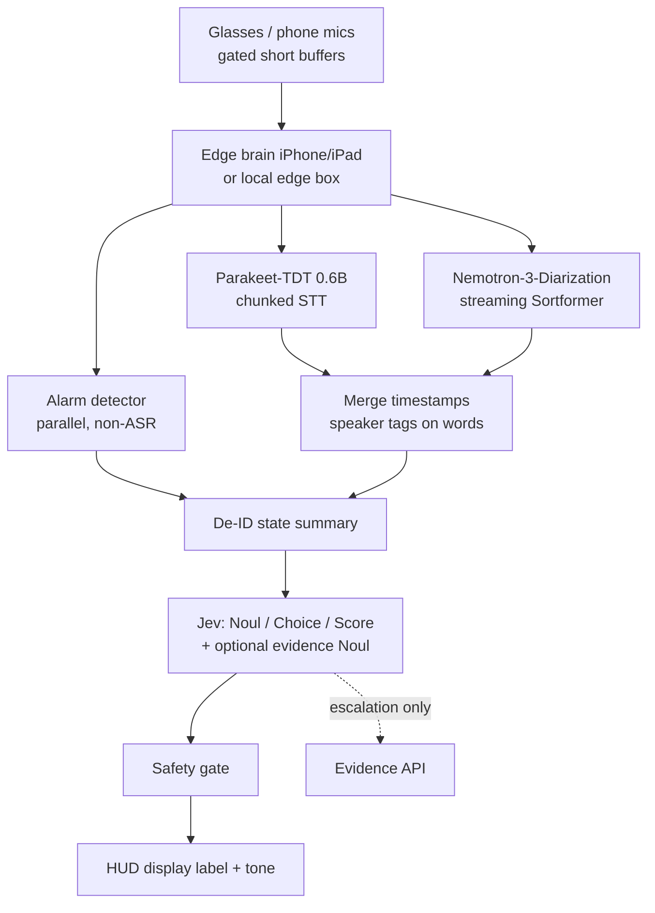

# V2A — NVIDIA speech stack (architecture note)

**Branch intent:** Parallel on-device speech path for Crisis Mirror V2.  
**Differs from V2B:** ASR base + diarization only.  
**Identical to V2B:** everything in [`V2-shared-layers.md`](./V2-shared-layers.md) (also pasted verbatim below).

**V2 cue model:** No protocol cards / pocket-binder / card lookup. Speech → de-ID summary → **Jev** (Noul / Choice / Score) → gate → HUD label + tone. See shared open questions OQ-1…OQ-5.

---

## Corrections to the brief (speech facts)

| Brief claim | Corrected fact | Source |
|-------------|----------------|--------|
| “Nemotron 3 Diarization” as the diarizer | **Confirmed.** `nvidia/Nemotron-3-Diarization`, released **2026-09-23**. Sortformer-family, **~100M / 99.2M params**, up to **8 speakers**, streaming + offline, **OpenMDW-1.1**. Supersedes 4-speaker Streaming Sortformer (`diar_streaming_sortformer_4spk-v2.1`). | [HF](https://huggingface.co/nvidia/Nemotron-3-Diarization), [blog](https://huggingface.co/blog/nvidia/nemotron-diarization) |
| Parakeet-TDT 0.6B + “CC-BY-4.0 / OpenMDW” as if both cover ASR | **Parakeet-TDT is CC-BY-4.0.** OpenMDW-1.1 governs **Nemotron 3 Diarization**, not Parakeet ASR weights. | [parakeet v3](https://huggingface.co/nvidia/parakeet-tdt-0.6b-v3), [OpenMDW-1.1](https://openmdw.ai/license/1-1/) |
| “or an existing medical fine-tune on Hugging Face” (implied English ICU) | Nearest public medical fine-tune: `johannhartmann/parakeet_de_med` — **German** PEFT of v3, **not** English Tx ICU. No verified English ICU Parakeet medical fine-tune at write time. | [parakeet_de_med](https://huggingface.co/johannhartmann/parakeet_de_med) |
| “Streaming” for Parakeet as first-class | NeMo exposes **chunked / buffered** streaming (left/right context). v3 is **not** natively cache-aware; true low-latency cache-aware ASR is a different NVIDIA line. Plan **chunked** ASR + streaming diarization. | [parakeet v3](https://huggingface.co/nvidia/parakeet-tdt-0.6b-v3) |

---

## Purpose

Stronger **noisy multi-speaker ICU** transcription and speaker separation for Phase 1 sim and Phase 2 camera-free clinical path, at the cost of a **heavier** on-device footprint (~600M ASR + ~100M diarization before quantization).

---

## Component list (speech only)

| Role | Choice | Params | License | Notes |
|------|--------|--------|---------|-------|
| ASR base | `nvidia/parakeet-tdt-0.6b-v2` (English) **or** `v3` (25 European langs) | ~600M | **CC-BY-4.0** | FastConformer-TDT; punctuation, capitalization, timestamps |
| Diarization | `nvidia/Nemotron-3-Diarization` | ~100M | **OpenMDW-1.1** | ≤8 speakers; streaming latency configs 0.32 s – 30.4 s input buffer |
| Ecosystem | NVIDIA **NeMo** / NeMo-Speech.cpp | — | toolkit licenses apply | Unified train / infer / export |
| On-device ports | FluidAudio CoreML (`FluidInference/parakeet-tdt-0.6b-v3-coreml`), ONNX / sherpa-onnx / NeMo-Speech.cpp GGUF q8 | — | conversion code often Apache-2.0; **weights remain CC-BY-4.0** | iOS 17+ / macOS 14+ |
| Fine-tune | NeMo PEFT / LoRA-style adapters + replay buffer | train subset | same as base | EN ICU adapter still to build |
| Alarm detection | **Separate** from ASR | small | TBD | Do not overload ASR with alarm tones |

Downstream (Jev, gate, HUD label, evidence, labels): **shared** — see below / `V2-shared-layers.md`. **No local protocol cards.**

---

## Data flow (V2A speech → shared)



---

## On-device footprint / compute (**estimates**)

| Item | Estimate | Cite / basis |
|------|----------|--------------|
| ASR params | ~600M | HF cards v2/v3 |
| Diarization params | ~100M | Nemotron-3-Diarization card |
| FP16 weight RAM (ASR alone) | ~1.2 GB | lucataco/parakeet-cli FP16 note |
| INT8 ASR | ~650 MB | same |
| CoreML batch RTF | ~110× on M4 Pro (batch) | FluidAudio CoreML card |
| Phone realism | **Marginal on older phones**; plausible on recent iPhone/iPad with ANE + quantized CoreML **if** chunked. Worst case: ASR+diar on **nearby edge box**, phone as HUD UI. | Open decision |
| Combined thermal | Continuous dual 600M+100M stresses battery/thermals | Risk |

All device timings are **estimates** until Crisis Mirror benches on target hardware.

---

## Diarization handling (V2A)

- Streaming modes: start ICU at **~1.04 s** input buffer; 0.32 s available with DER tradeoff.
- Speaker limit: **8**. More voices → overflow / “other” policy.
- Overlap: trained with overlap; still measure DER under alarm noise.
- Merge: ASR word timestamps × diarization segments → `speaker_k: text` in de-ID summary (roles like attending/nurse/unknown — never real names in Phase 2 without policy).

---

## Fine-tuning data pipeline (V2A-specific)

1. **Phase 1 sim audio:** scripted multi-speaker ICU scenarios (actors); no PHI.  
2. **De-ID tooling:** run the same stripper in sim so the path is exercised.  
3. **Labels:** human transcripts + KER keyword lists.  
4. **Train:** NeMo PEFT on Parakeet; freeze large encoder portions; **replay buffer** of prior domains.  
5. **Eval set:** frozen multi-speaker noisy hold-out.  
6. **Who holds data:** sim lab PI / VCU per IRB; engineering gets de-ID features only.  
7. **Phase 2:** real audio only under IRB + BAA/de-ID; no raw audio to Jev.

---

## Licensing summary (V2A)

| Artifact | License |
|----------|---------|
| Parakeet-TDT weights | CC-BY-4.0 |
| Nemotron-3-Diarization | OpenMDW-1.1 |
| FluidAudio / conversion code | typically Apache-2.0 (check repo) |

Counsel review still required for clinical distribution.

---

## Risks

- Phone thermal / RAM under dual large models.  
- Chunked ASR latency vs cue budget (Jev still ~70–500 ms **after** text exists).  
- No English ICU medical Parakeet adapter yet.  
- Alarm noise + overlap; keep alarm path separate.  
- OpenMDW + CC-BY mix: track redistribution notices.  
- **Product:** cue render path (category label map vs generative) unresolved — see OQ-1.

---

## Open decisions for the software engineer

### Speech / on-device

1. **Compute budget:** target device (iPhone 15+/iPad vs edge NUC)? RAM? Speech→summary latency? Battery/thermal? Does 0.6B + diar **realistically** run on phone?  
2. **v2 English vs v3 multilingual** for US Tx ICU sim.  
3. **Streaming vs chunked** ASR params paired with Nemotron diarization latency mode.  
4. **Speaker count** policy when >8.  
5. **Overlap + alarm** stress tests; separate alarm detector.  
6. **Fine-tune data:** sim provenance, KER lexicon, replay composition, eval freeze, custodian, Phase 2 BAA/IRB.  
7. **Export:** CoreML (FluidAudio) vs ONNX/sherpa vs NeMo-Speech.cpp for Android.  
8. **Fallback** if on-device ASR OOM/overheat.

### Product / shared (from architecture reset — do not bury)

9. **OQ-1** Cue render: category→≤8-word vetted label (default proposal) vs generative LLM.  
10. **OQ-2** Taxonomy owner, category count, `none`/`other` handling.  
11. **OQ-3** Escalation trigger (separate Noul vs category flag); evidence UI + latency.  
12. **OQ-4** Gate on Noul only vs Noul + Choice confidence.  
13. **OQ-5** Labels tune thresholds only vs also taxonomy revisions (Jev weights not fine-tuned by us).

---

## Shared layers (verbatim copy of `V2-shared-layers.md`)

> Canonical file: [`V2-shared-layers.md`](./V2-shared-layers.md). Identical for V2A and V2B.

### Open questions created by the V2 architecture reset

**OQ-1 — Cue without cards.** Jev emits no free text. **Default proposal:** each Choice category carries a clinician-vetted ≤8-word advisory **display label**; UI renders it verbatim (thin category→label map — a closed list still exists, much smaller than a V1 card library). **Alternative:** generative LLM cue text (hallucination risk, extra latency/cloud, PHI/BAA surface). Explicit decision required.

**OQ-2 — Taxonomy.** Who owns/approves categories; how many; `none`/`other` handling.

**OQ-3 — Escalation.** Separate Jev Noul *needs external evidence?* vs category flag; what evidence shows as; latency.

**OQ-4 — Gate.** Noul probability only vs also Choice confidence.

**OQ-5 — Labels.** Tune thresholds (and maybe taxonomy offline); **not** Jev weights.

### 1. ASR flywheel

Capture gated audio → de-identify PHI → KER error analysis → LoRA/PEFT retrain with replay buffer → deploy/monitor. Offline only; never silent bedside self-change.

### 2. Jev — core decision & categorization

Input: de-ID state summary. Outputs *are* the decision:

- **Noul** — action warranted?  
- **Choice** — situation **category** (closed set ≤255 + confidence)  
- **Score** — urgency  

Vendor: TypeSafe AI Jev via `typesafe-ai/jev` (~70–500 ms, ~$0.042/M input tokens claimed). Calibration unpublished. ZDR ≠ HIPAA BAA. Optional fourth Noul: *needs external evidence?*

### 3. Conditional deeper research

OpenEvidence / UpToDate-class **only** when Jev escalates. Default path: no evidence API. Stripped queries only.

### 4. Safety gate (simplified)

≥0.9 fire · 0.6–0.9 silent log · <0.6 nothing (tune from labels) · rate limits · strip identifiers. **No card-wording validation.**

### 5. Offline labeling loop

helpful/accurate on fired cues → feeds **ASR flywheel** and **Jev threshold tuning**. We do not fine-tune Jev.

### Shared data flow

```
speech (V2A|V2B) → de-ID summary → Jev (Noul/Choice/Score[/evidence Noul])
  → optional evidence API on escalation
  → gate → HUD display label + tone → clinician
  → labels → ASR flywheel + Jev thresholds
```

---

## Sources (V2A-specific)

- https://huggingface.co/nvidia/parakeet-tdt-0.6b-v2  
- https://huggingface.co/nvidia/parakeet-tdt-0.6b-v3  
- https://huggingface.co/nvidia/Nemotron-3-Diarization  
- https://huggingface.co/blog/nvidia/nemotron-diarization  
- https://openmdw.ai/license/1-1/  
- https://huggingface.co/FluidInference/parakeet-tdt-0.6b-v3-coreml  
- https://huggingface.co/johannhartmann/parakeet_de_med  
- https://github.com/lucataco/parakeet-cli  
