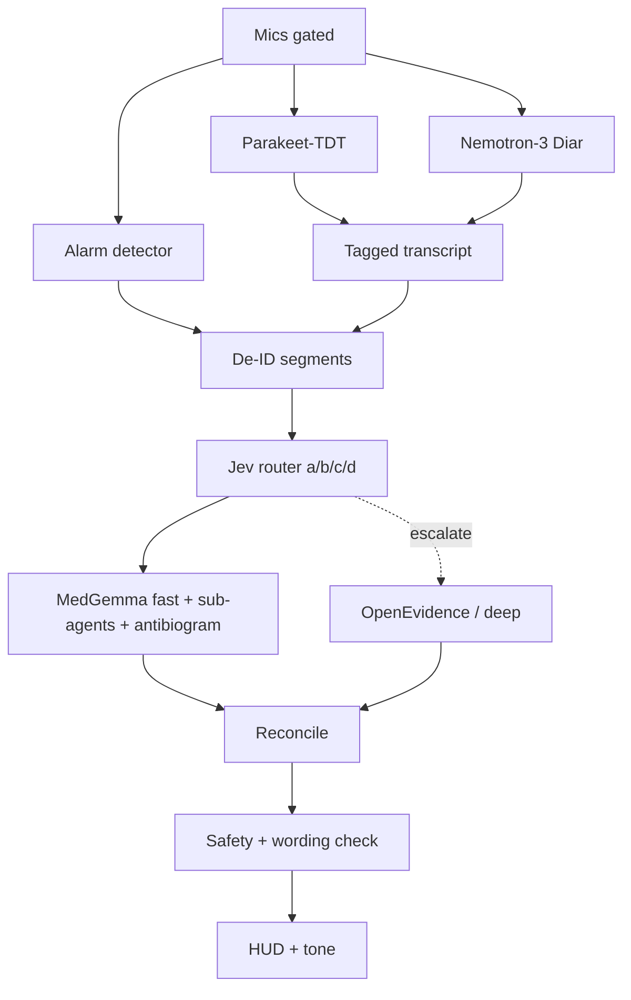

# V2A — NVIDIA speech stack + shared Jev-router path

**Differs from V2B:** ASR + diarization only.  
**Identical shared path:** [`V2-shared-layers.md`](./V2-shared-layers.md) (Jev multi-point router → MedGemma fast path / deep research → gate → HUD).  
**No protocol cards.**

Read **FLAG-1…FLAG-5** in the shared note before locking phone-only or continuous-Jev designs.

---

## Corrections to the brief (speech)

| Brief claim | Corrected fact | Source |
|-------------|----------------|--------|
| Nemotron 3 Diarization | **Exists** `nvidia/Nemotron-3-Diarization` (2026-09-23), ~100M, ≤8 spk, streaming, **OpenMDW-1.1** | [HF](https://huggingface.co/nvidia/Nemotron-3-Diarization) |
| Parakeet “CC-BY / OpenMDW” | Parakeet = **CC-BY-4.0**; OpenMDW = Nemotron diarization | [parakeet v3](https://huggingface.co/nvidia/parakeet-tdt-0.6b-v3) |
| English ICU medical Parakeet on HF | Only clear public medical PEFT found: **German** `parakeet_de_med` | [HF](https://huggingface.co/johannhartmann/parakeet_de_med) |
| Parakeet native streaming | **Chunked/buffered**; not cache-aware | HF card / community |

---

## Purpose

Maximize noisy multi-speaker ICU ASR+diarization accuracy (heavier footprint) feeding the **same** Jev-router + MedGemma/deep paths as V2B.

---

## Speech components

| Role | Choice | Params | License |
|------|--------|--------|---------|
| ASR | Parakeet-TDT 0.6B v2 (En) or v3 (multi) | ~600M | CC-BY-4.0 |
| Diarization | Nemotron-3-Diarization | ~100M | OpenMDW-1.1 |
| Ports | FluidAudio CoreML, ONNX, NeMo-Speech.cpp | — | weights CC-BY-4.0 |
| Alarms | Separate detector | small | TBD |

---

## Data flow

---

## On-device estimates + FLAG-2

| Stack | Estimate |
|-------|----------|
| ASR FP16 / INT8 | ~1.2 GB / ~0.65 GB |
| Diarization | ~100M add-on |
| + MedGemma 4B Q4 | +~2.3–2.5 GB weights, often 3–5 GB RAM |
| Combined | **Likely exceeds sustained phone budget** → **edge box recommended** |

CoreML Parakeet alone ~110× RTF on M4 Pro (batch) — does not imply headroom for MedGemma concurrently.

---

## Diarization / fine-tune (speech)

Same as prior V2A: streaming ~1.04 s start; ≤8 speakers; NeMo PEFT + replay; Phase 1 sim no PHI; Phase 2 IRB/BAA.

---

## Risks (V2A-specific + shared flags)

- Thermals/RAM (FLAG-2).  
- Continuous Jev salience (FLAG-1).  
- Generative cue hallucination (FLAG-3).  
- Domain “sub-agents” must be prompts/LoRA/separate (FLAG-4).  
- No live VCU feeds via Grok Bot (FLAG-5).

---

## Open decisions (engineer)

**Speech:** compute budget; v2 vs v3; chunk params; >8 speakers; alarms; fine-tune custody; CoreML vs ONNX; fallbacks.  

**Shared:** all OQ-R1…R10 in shared note (taxonomy, Gemma placement, antibiogram, latency, reconcile, Jev budget, FLAG-1, cue path, deep vendor).

---

## Shared layers (verbatim summary)

Canonical: [`V2-shared-layers.md`](./V2-shared-layers.md).

Jev routes at (a) salience (b) category→sub-agent/lookup (c) deep escalation (d) action/urgency.  
Fast path: MedGemma (HAI-DEF) or lighter Gemma 3n; ID example + local CLSI-M39-style antibiogram table.  
Deep path: OE/other only if escalated; **no public OE self-serve API verified**.  
Cue: MedGemma generative leading + wording check; vetted label fallback.  
Labels → ASR flywheel + Jev thresholds + Gemma cue-quality data.  
Flags FLAG-1…5 apply.

---

## Sources (V2A)

- https://huggingface.co/nvidia/parakeet-tdt-0.6b-v2  
- https://huggingface.co/nvidia/parakeet-tdt-0.6b-v3  
- https://huggingface.co/nvidia/Nemotron-3-Diarization  
- https://huggingface.co/FluidInference/parakeet-tdt-0.6b-v3-coreml  
- Shared MedGemma / OE / antibiogram sources in V2-shared-layers.md  
