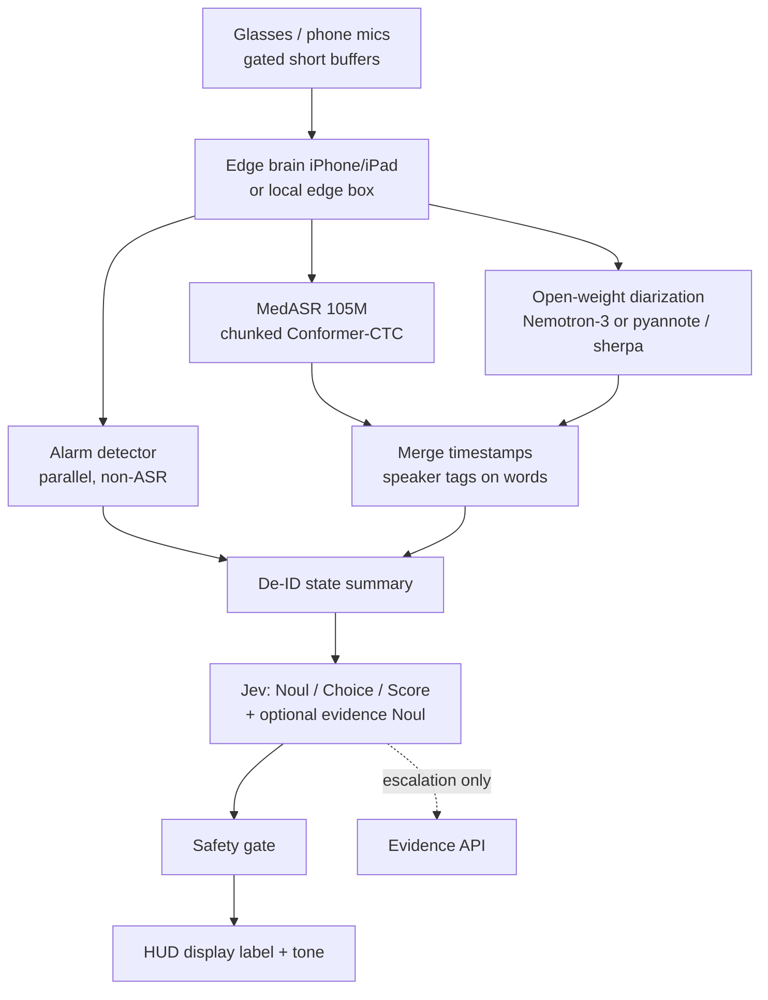

# V2B — Google / MedASR speech stack (architecture note)

**Branch intent:** Parallel on-device speech path for Crisis Mirror V2.  
**Differs from V2A:** ASR base + diarization only.  
**Identical to V2A:** everything in [`V2-shared-layers.md`](./V2-shared-layers.md) (also pasted verbatim below).

**V2 cue model:** No protocol cards / pocket-binder / card lookup. Speech → de-ID summary → **Jev** (Noul / Choice / Score) → gate → HUD label + tone. See shared open questions OQ-1…OQ-5.

---

## Corrections to the brief (speech facts)

| Brief claim | Corrected fact | Source |
|-------------|----------------|--------|
| MedASR license = “Apache 2.0” | **Incorrect for weights.** MedASR **weights** = **Health AI Developer Foundations (HAI-DEF) Terms of Use**. Supporting **code** in Google-Health/medasr is Apache 2.0. Open-weight with redistribution / clinical-use constraints. | [model card](https://developers.google.com/health-ai-developer-foundations/medasr/model-card), [HF](https://huggingface.co/google/medasr), [terms](https://developers.google.com/health-ai-developer-foundations/terms), [FAQs](https://developers.google.com/health-ai-developer-foundations/faqs) |
| MedASR as general conversational ICU ASR | **105M Conformer** pre-trained for **medical dictation** (~5,000 h). Limitations: **English-only**, mostly high-quality mics, US L1 speakers; may degrade on **noisy / low-quality** ambient audio — the ICU gap. Fine-tune expected. | Same model card |
| MedASR “streaming” | **Chunked** / sliding-window pseudo-streaming (`chunk_length_s` / `stride_length_s`), not a first-party cache-aware streaming product claim. | HF README / model card |
| “Separate open-weight diarization” unspecified | Candidates differ on license and on-device path. **Nemotron-3-Diarization can pair with MedASR** (cross-stack). | See pairings below |

---

## Purpose

**Lighter** on-device ASR (~105M, medical dictation prior) for phone-first Phase 1 sim, accepting a **larger accuracy gap** on noisy multi-speaker ambient ICU speech that fine-tuning must close. Diarization is **not** bundled.

---

## Component list (speech only)

| Role | Choice | Params | License | Notes |
|------|--------|--------|---------|-------|
| ASR base | `google/medasr` | **105M** | **HAI-DEF** (weights); code Apache-2.0 | Conformer-CTC; English; dictation bias |
| Diarization | See recommended pairings | varies | varies | Not included with MedASR |
| Fine-tune | Official HF fine-tune notebook; add PEFT/LoRA yourself if needed | — | HAI-DEF on derivatives | Conversational ICU adapters needed |
| Alarm detection | Separate from ASR | small | TBD | Same as V2A |
| On-device | Transformers / ONNX / experimental MLX; weaker CoreML story than FluidAudio+Parakeet | — | — | Open decision |

Downstream: **shared Jev path**. **No local protocol cards.**

---

## Recommended V2B diarization pairings

| Priority | Model | License | Speakers / streaming | On-device | Why |
|----------|-------|---------|----------------------|----------|-----|
| **A — default recommend** | `nvidia/Nemotron-3-Diarization` | **OpenMDW-1.1** | ≤8; **streaming** | NeMo / NeMo-Speech.cpp / Transformers | Best open accuracy/streaming; commercial-clear; **pairs with MedASR** |
| **B — Apple-leaning OSS** | `pyannote/speaker-diarization-community-1` | **CC-BY-4.0** (HF gated) | Pipeline + exclusive mode | pyannote.audio local | Strong OSS; awkward on-phone — better edge box |
| **C — mobile ONNX** | sherpa-onnx (pyannote seg 3.0 ONNX + embedding) | Runtime Apache-2.0; **audit each weight license** | Offline-oriented | Real Android/iOS APKs | Phone-port track after license audit |
| Avoid for commercial v1 | DiariZen / Revai reverb-style NC bundles | often **CC-BY-NC** | — | ONNX may exist | Blocks commercial path |

**Recommendation:** **MedASR + Nemotron-3-Diarization** unless counsel or “no NVIDIA in Google lane” policy forbids it. Fallback: MedASR + pyannote community-1 on edge box.

---

## Data flow (V2B speech → shared)



---

## On-device footprint / compute (**estimates**)

| Item | Estimate | Cite / basis |
|------|----------|--------------|
| ASR params | 105M | MedASR model card |
| FP16 ASR RAM | ~200–250 MB class | order-of-magnitude (**estimate**) |
| Diarization add-on | +~100M if Nemotron-3; pyannote heavier in practice | Nemotron card / pyannote docs |
| Phone realism | **Better than 0.6B** for ASR-only; diarization still hard | Open decision |
| Domain gap | Dictation → ambient ICU needs substantial fine-tune | Model card limitations |

---

## Diarization handling (V2B)

- Same merge as V2A: timestamps × segments → role-tagged de-ID lines.  
- Nemotron-3: start ~1.04 s streaming buffer.  
- pyannote community-1: prefer exclusive diarization for ASR alignment; edge-box first.  
- sherpa-onnx: offline chunks; confirm streaming needs separately.

---

## Fine-tuning data pipeline (V2B-specific)

1. Same Phase 1 sim multi-speaker scripts as V2A (fair A/B).  
2. Fine-tune MedASR toward **conversational + noise + overlap**.  
3. Official Transformers fine-tune notebook; add **PEFT/LoRA** if full SFT is too heavy.  
4. KER + replay buffer per shared flywheel.  
5. HAI-DEF: derivatives remain under HAI-DEF; carry notices / use restrictions.  
6. Data custody / IRB / BAA same Phase 2 gates.

---

## Licensing summary (V2B)

| Artifact | License |
|----------|---------|
| MedASR weights | **HAI-DEF Terms of Use** (not Apache 2.0) |
| medasr GitHub code | Apache 2.0 |
| Nemotron-3-Diarization (if paired) | OpenMDW-1.1 |
| pyannote community-1 | CC-BY-4.0 (gated HF) |
| sherpa-onnx runtime | Apache 2.0; weights separate |

Counsel should review HAI-DEF clinical-use and “manufacturer” clauses before Phase 2.

---

## Risks

- License mis-statement (Apache vs HAI-DEF) — corrected here.  
- Dictation→ambient domain shift may erase “already medical-tuned” advantage until fine-tuned.  
- English-only.  
- Diarization may re-introduce NVIDIA into the “Google stack” lane — be honest in diagrams.  
- Weaker public on-device story than FluidAudio+Parakeet.  
- **Product:** cue render path unresolved — OQ-1.

---

## Open decisions for the software engineer

### Speech / on-device

1. **Compute budget:** phone-only MedASR with which diarizer? RAM, latency, battery/thermal.  
2. **Diarization pairing:** Nemotron-3 (recommended) vs pyannote community-1 vs sherpa-onnx after license audit.  
3. **Fine-tune recipe:** SFT vs LoRA; sim audio; de-ID; KER; replay; eval; custodian; BAA/IRB.  
4. **Chunk windows** for MedASR under cue latency budget.  
5. **Speaker limit / overlap / alarms.**  
6. **Export:** ONNX / CoreML / MLX primary runtime.  
7. **Fallback** if MedASR KER fails noisy sim.

### Product / shared (architecture reset)

8. **OQ-1** Category→display label vs generative cue.  
9. **OQ-2** Taxonomy ownership / size / `none`.  
10. **OQ-3** Escalation design + evidence UI.  
11. **OQ-4** Gate on Noul vs Noul+Choice conf.  
12. **OQ-5** Labels → thresholds (± taxonomy); not Jev weights.

---

## Shared layers (verbatim copy of `V2-shared-layers.md`)

> Canonical file: [`V2-shared-layers.md`](./V2-shared-layers.md). Identical for V2A and V2B.

### Open questions created by the V2 architecture reset

**OQ-1 — Cue without cards.** Jev emits no free text. **Default proposal:** each Choice category carries a clinician-vetted ≤8-word advisory **display label**; UI renders it verbatim (thin category→label map — a closed list still exists, much smaller than a V1 card library). **Alternative:** generative LLM cue text (hallucination risk, extra latency/cloud, PHI/BAA surface). Explicit decision required.

**OQ-2 — Taxonomy.** Who owns/approves categories; how many; `none`/`other` handling.

**OQ-3 — Escalation.** Separate Jev Noul *needs external evidence?* vs category flag; what evidence shows as; latency.

**OQ-4 — Gate.** Noul probability only vs also Choice confidence.

**OQ-5 — Labels.** Tune thresholds (and maybe taxonomy offline); **not** Jev weights.

### 1. ASR flywheel

Capture gated audio → de-identify PHI → KER error analysis → LoRA/PEFT retrain with replay buffer → deploy/monitor. Offline only; never silent bedside self-change.

### 2. Jev — core decision & categorization

Input: de-ID state summary. Outputs *are* the decision:

- **Noul** — action warranted?  
- **Choice** — situation **category** (closed set ≤255 + confidence)  
- **Score** — urgency  

Vendor: TypeSafe AI Jev via `typesafe-ai/jev` (~70–500 ms, ~$0.042/M input tokens claimed). Calibration unpublished. ZDR ≠ HIPAA BAA. Optional fourth Noul: *needs external evidence?*

### 3. Conditional deeper research

OpenEvidence / UpToDate-class **only** when Jev escalates. Default path: no evidence API. Stripped queries only.

### 4. Safety gate (simplified)

≥0.9 fire · 0.6–0.9 silent log · <0.6 nothing (tune from labels) · rate limits · strip identifiers. **No card-wording validation.**

### 5. Offline labeling loop

helpful/accurate on fired cues → feeds **ASR flywheel** and **Jev threshold tuning**. We do not fine-tune Jev.

### Shared data flow

```
speech (V2A|V2B) → de-ID summary → Jev (Noul/Choice/Score[/evidence Noul])
  → optional evidence API on escalation
  → gate → HUD display label + tone → clinician
  → labels → ASR flywheel + Jev thresholds
```

---

## Sources (V2B-specific)

- https://developers.google.com/health-ai-developer-foundations/medasr/model-card  
- https://huggingface.co/google/medasr  
- https://developers.google.com/health-ai-developer-foundations/terms  
- https://developers.google.com/health-ai-developer-foundations/faqs  
- https://huggingface.co/nvidia/Nemotron-3-Diarization  
- https://huggingface.co/pyannote/speaker-diarization-community-1  
- https://k2-fsa.github.io/sherpa/onnx/speaker-diarization/models.html  
