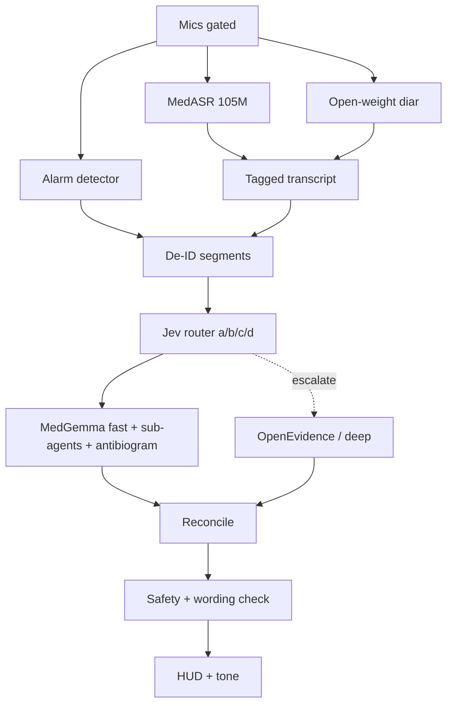

# V2B — Google / MedASR speech stack + shared Jev-router path

**Differs from V2A:** ASR + diarization only.  
**Identical shared path:** [`V2-shared-layers.md`](./V2-shared-layers.md).  
**No protocol cards.**

Read **FLAG-1…FLAG-5** in the shared note first.

---

## Corrections to the brief (speech)

| Brief claim | Corrected fact | Source |
|-------------|----------------|--------|
| MedASR = Apache 2.0 | **Weights = HAI-DEF**; code Apache 2.0 | [card](https://developers.google.com/health-ai-developer-foundations/medasr/model-card) |
| Conversational ICU-ready | **Dictation-prior**, EN-only; noisy ambient gap | same |
| Streaming | Chunked / sliding-window | HF README |
| Diarization bundled | **No** — pick open-weight pair | — |

---

## Purpose

Lighter medical-dictation ASR prior for phone-friendlier speech, same Jev-router + MedGemma/deep shared path. Note: stacking MedGemma still pushes toward **edge box** (FLAG-2).

---

## Speech components

| Role | Choice | Params | License |
|------|--------|--------|---------|
| ASR | `google/medasr` | 105M Conformer | **HAI-DEF** |
| Diarization | See pairings | varies | varies |
| Fine-tune | Transformers SFT ± PEFT | — | HAI-DEF derivatives |
| Alarms | Separate | small | TBD |

### Recommended diarization

1. **Nemotron-3-Diarization** (OpenMDW-1.1) — default  
2. pyannote community-1 (CC-BY-4.0) on edge box  
3. sherpa-onnx after weight-license audit  

---

## Data flow

---

## On-device estimates

MedASR alone is phone-plausible; **+ diar + MedGemma** still FLAG-2. Community note: some apps **sequentially** load MedASR then MedGemma (never both) to fit 8 GB phones — incompatible with always-on ambient ASR unless edge box or duty-cycled design.

---

## Fine-tune / risks / open decisions

Fine-tune MedASR toward conversational+noise; HAI-DEF on derivatives.  
Risks: license, domain shift, FLAG-1…5.  
Open decisions: same speech list as before + shared OQ-R1…R10.

---

## Shared layers (verbatim summary)

Canonical: [`V2-shared-layers.md`](./V2-shared-layers.md).

Jev multi-point router (a–d) · MedGemma/Gemma3n fast path · deep research on escalation · generative cue leading + wording check · antibiogram local static · labels → ASR + Jev thresholds + Gemma cue quality · FLAG-1…5.

---

## Sources (V2B)

- https://developers.google.com/health-ai-developer-foundations/medasr/model-card  
- https://huggingface.co/google/medasr  
- https://huggingface.co/nvidia/Nemotron-3-Diarization  
- https://huggingface.co/pyannote/speaker-diarization-community-1  
- Shared MedGemma / OE / antibiogram sources in V2-shared-layers.md  
